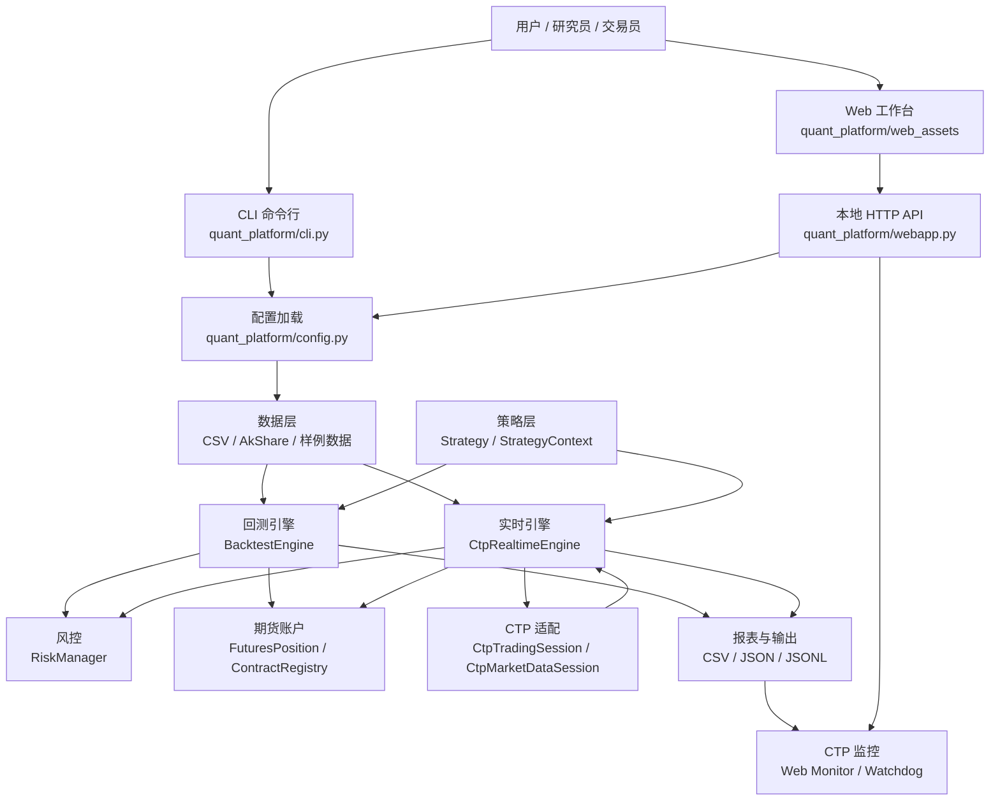
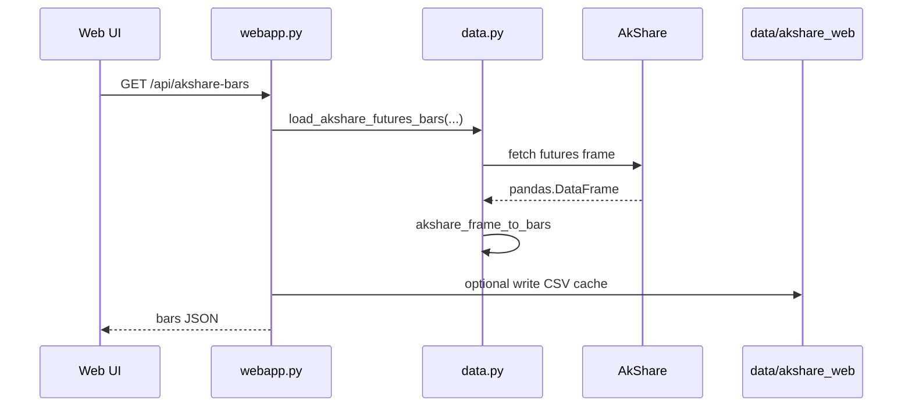
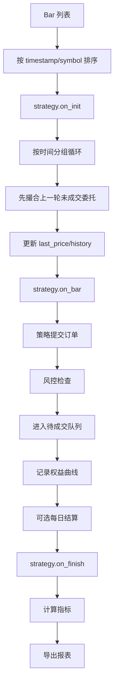
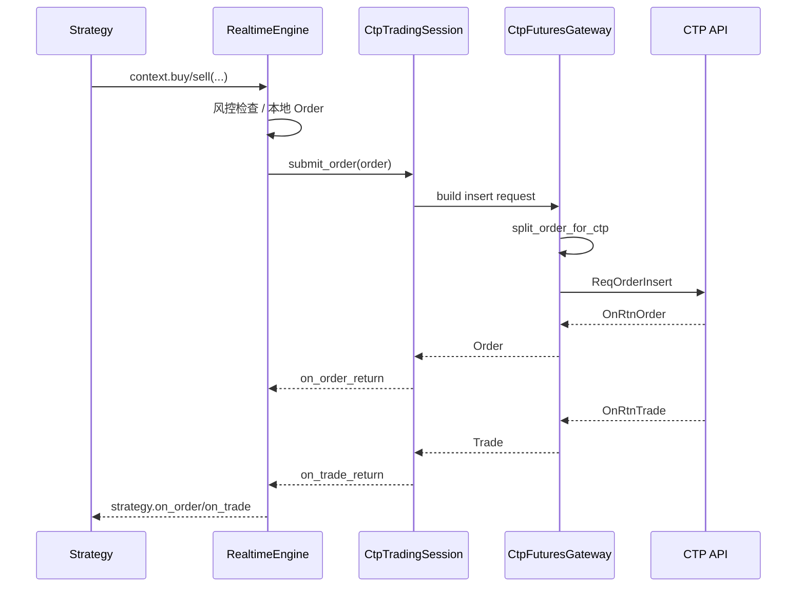
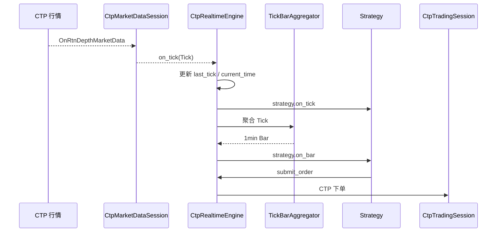
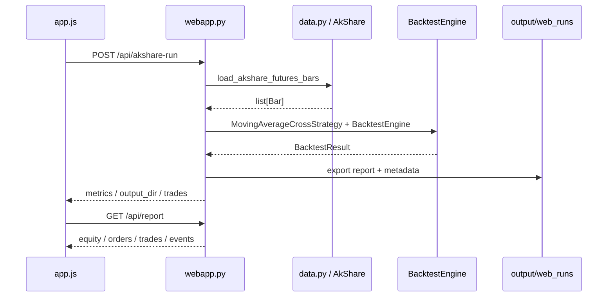

# 期货量化平台技术架构与工程手册

更新日期：2026-05-22

本文档面向后续持续开发、重构、联调和排障使用。它不是普通 README，而是一份接近项目专用 skill 的工程手册：读完后，开发者应当知道当前系统已经具备什么能力、核心技术边界在哪里、每个模块应该怎样修改，以及每次改动后需要怎样验证。

## 1. 项目定位

当前项目的主线目标是模仿 TBQuant 的使用体验，构建一个面向国内期货的本地量化交易软件。系统以研究、回测、纸面交易、CTP 实时行情和 CTP 交易柜台为核心，当前明确只做期货 CTP 柜台，不做券商股票柜台。

项目当前有两条代码线：

- `quant_platform/`：主量化平台，包含数据、策略、回测、期货账户、风控、CTP、实时引擎、Web 工作台和 CLI。
- `futures_positions/`：历史遗留的期货会员持仓采集工具，偏数据采集/整理，不是主交易引擎。

后续新增能力时，应优先进入 `quant_platform/`。除非明确是在维护会员持仓数据采集逻辑，否则不要把交易、回测、CTP 或 Web 工作台的新能力放入 `futures_positions/`。

## 2. 当前能力总览

平台已经覆盖了一个本地期货量化软件的主要闭环：

| 能力 | 当前状态 | 关键模块 |
| --- | --- | --- |
| 基础领域模型 | 已完成 | `models.py` |
| 策略抽象 | 已完成 | `strategy.py`, `sample_strategies.py` |
| CSV 历史数据 | 已完成 | `data.py`, `datacenter.py` |
| AkShare 历史数据 | 已完成 | `data.py`, `config.py`, `webapp.py` |
| 回测引擎 | 已完成 | `backtest.py`, `reporting.py` |
| 期货账户语义 | 已完成 | `futures.py` |
| 执行成本 | 已完成 | `execution.py` |
| 风控检查 | 已完成 | `risk.py` |
| 参数优化 | 已完成 | `optimization.py` |
| 行情回放 | 已完成 | `replay.py` |
| 模拟交易 | 已完成 | `paper.py` |
| CTP 委托映射 | 已完成 | `ctp.py` |
| CTP 交易会话 | 已完成 | `ctp.py` |
| CTP 行情会话 | 已完成 | `ctp.py` |
| CTP 实时策略引擎 | 已完成 | `realtime.py` |
| Tick 聚合 1 分钟 K 线 | 已完成 | `realtime.py` |
| 实时状态恢复 | 已完成 | `realtime.py` |
| 事件日志与轮转 | 已完成 | `events.py` |
| CTP 看门狗/健康检查 | 已完成 | `watchdog.py`, `webapp.py` |
| 本地 Web 工作台 | 已完成并中文化 | `webapp.py`, `web_assets/` |
| 自选合约与 K 线图 | 已完成 | `web_assets/app.js` |
| K 线均线、悬浮、缩放、平移 | 已完成 | `web_assets/app.js` |
| 小白友好 UI 重组 | 已完成 | `web_assets/index.html`, `app.css`, `app.js` |

当前数据来源策略：

- 历史研究和 Web 回测：优先使用 AkShare。
- 本地可重复测试：使用 CSV 或生成样例数据。
- 实时行情和真实交易方向：使用 CTP 行情/交易会话。

## 3. 技术栈

后端技术：

- Python 标准库 HTTP 服务：`http.server` 提供本地 Web 工作台。
- Pandas：CSV、K 线数据框、权益曲线、指标计算、报表导出。
- AkShare：国内期货历史行情拉取。
- dataclasses：领域模型和配置对象。
- argparse：CLI 子命令。
- JSON/CSV/JSONL：配置、结果报表、事件日志和状态持久化。
- CTP 原生 Python 绑定适配点：通过 `transport_module`、`trader_api_factory`、`md_api_factory` 注入。

前端技术：

- 原生 HTML/CSS/JavaScript，无前端框架。
- Canvas 绘制 K 线图和权益曲线。
- Fetch API 调用本地后端接口。
- localStorage 保存自选合约。
- lucide 图标增强按钮识别度。

设计取向：

- 桌面本地软件风格，优先清晰、可扫读、可操作。
- 功能入口中文化，避免只给专业名词。
- 面向新手：把“先看行情、再跑回测、再看结果、最后看监控”的工作流显性化。
- 面向后续交易：后端保留严格的 CTP、风控、状态恢复和日志边界。

## 4. 总体架构

系统按层分为：入口层、应用服务层、领域引擎层、适配器层、持久化层。



架构核心原则：

1. 策略不直接接触数据文件、CTP API 或 Web API。策略只通过 `StrategyContext` 获取历史、行情、持仓和下单能力。
2. 回测和实时尽量复用同一套策略接口。策略的 `on_bar`、`on_tick`、`on_order`、`on_trade` 在不同引擎下由引擎负责驱动。
3. CTP 适配层与领域模型隔离。CTP 原始字段先转换为 `Order`、`Trade`、`Tick`、`FuturesPosition` 等内部模型，再进入引擎。
4. 期货语义集中在 `futures.py`。合约乘数、保证金率、手续费、今昨仓、平今/平昨不要分散到策略或 Web 层。
5. 事件日志是排障主线。回测、实时、CTP 会话、监控都应尽量把关键状态变化写入结构化事件。

## 5. 目录地图

```text
.
├── quant_platform/
│   ├── models.py              # Bar/Tick/Order/Trade/Position 等基础模型
│   ├── strategy.py            # Strategy 与 StrategyContext
│   ├── sample_strategies.py   # 示例策略
│   ├── data.py                # CSV、AkShare、样例行情
│   ├── datacenter.py          # 数据校验、交易日增强、重采样
│   ├── backtest.py            # 回测引擎
│   ├── reporting.py           # 指标与报表导出
│   ├── futures.py             # 期货合约、手续费、今昨仓、保证金
│   ├── execution.py           # 滑点、手续费率、最小手续费配置
│   ├── risk.py                # 下单风控
│   ├── optimization.py        # 参数网格优化
│   ├── replay.py              # 历史行情回放
│   ├── paper.py               # 模拟交易
│   ├── ctp.py                 # CTP 交易、行情、字段映射、回调适配
│   ├── realtime.py            # CTP 实时策略引擎、状态恢复、Tick 聚合
│   ├── watchdog.py            # 实时连接健康检查
│   ├── events.py              # RunEvent、EventRecorder、JSONL/CSV 导出
│   ├── config.py              # JSON 配置加载与归一化
│   ├── webapp.py              # 本地 Web API 服务
│   └── web_assets/
│       ├── index.html         # 中文 Web 工作台结构
│       ├── app.css            # 工作台样式
│       └── app.js             # 交互、K线、回测、监控
├── docs/
│   └── quant_platform_phase*.md # 历史阶段记录
├── tests/
│   └── test_quant_platform.py # 当前主测试套件
├── examples/                  # 示例配置/数据
├── data/                      # 本地数据与 AkShare 缓存
├── output/                    # 回测、Web、CTP 状态与日志输出
└── futures_positions/         # 期货会员持仓采集旁支工具
```

## 6. 领域模型层

文件：`quant_platform/models.py`

领域模型是整个系统的共同语言。后续模块之间传递数据时，应优先使用这些模型，而不是裸 dict。

### 6.1 枚举

| 枚举 | 取值 | 用途 |
| --- | --- | --- |
| `Side` | `BUY`, `SELL` | 买卖方向 |
| `OrderType` | `MARKET`, `LIMIT` | 市价/限价 |
| `Offset` | `AUTO`, `OPEN`, `CLOSE`, `CLOSE_TODAY`, `CLOSE_YESTERDAY` | 开平仓语义 |
| `OrderStatus` | `PENDING`, `FILLED`, `REJECTED`, `CANCELED` | 委托状态 |

其中 `Offset` 是期货平台的关键抽象。股票系统通常没有今昨仓和平今规则，但国内期货尤其上期所/能源中心会涉及平今、平昨差异，所以后续所有下单链路都要保留 `offset`。

### 6.2 行情模型

`Bar` 表示 OHLCV K 线：

- `symbol`：合约代码，如 `RB0`、`rb2410`。
- `timestamp`：K 线时间。
- `open/high/low/close`：价格。
- `volume`：成交量。
- `extra`：来源、交易日、原始字段等扩展信息。

`Tick` 表示实时行情：

- `last_price`：最新价。
- `volume`、`turnover`、`open_interest`：成交量、成交额、持仓量。
- `bid_price_1`、`ask_price_1` 等一档盘口字段。
- `open_price/high_price/low_price/pre_close_price` 等日内字段。

`extra` 字段用于兼容数据源差异，但不要把核心业务语义长期藏在 `extra` 中。如果字段会被多个模块依赖，应提升为模型显式字段。

### 6.3 交易模型

`Order` 表示本地委托：

- `order_id`：本地订单号。
- `symbol`、`side`、`quantity`。
- `submitted_at`、`filled_at`。
- `order_type`、`offset`、`limit_price`。
- `status`。
- `fill_price`、`commission`。
- `reject_reason`。

`Trade` 表示成交：

- `trade_id`、`order_id`。
- `symbol`、`side`、`quantity`、`price`。
- `commission`、`timestamp`。
- `offset`。
- `notional`、`margin`、`realized_pnl`。

`Position` 是简化的净持仓模型，适合现金账户或简化回测；期货真实语义使用 `FuturesPosition`。

## 7. 策略层

文件：`quant_platform/strategy.py`

策略层由两个核心类组成：

- `StrategyContext`：策略访问引擎的唯一入口。
- `Strategy`：策略生命周期基类。

### 7.1 StrategyContext

策略通过 `context` 完成查询和交易：

```python
context.now
context.buy(symbol, quantity, order_type, limit_price, offset)
context.sell(symbol, quantity, order_type, limit_price, offset)
context.target_position(symbol, target_quantity)
context.history(symbol, limit)
context.closes(symbol, limit)
context.position(symbol)
context.last_price(symbol)
context.last_tick(symbol)
```

重要约定：

- `buy` 和 `sell` 只是方向，不必然等于开仓或平仓；开平仓由 `offset` 决定。
- `target_position` 使用净持仓语义，适合研究和示例策略；实盘期货若涉及复杂今昨仓，应该显式使用 `offset`。
- 策略不应直接调用 `BacktestEngine`、`CtpTradingSession` 或 Web API。

### 7.2 Strategy 生命周期

策略基类提供以下回调：

```python
def on_init(self, context): ...
def on_bar(self, context, bar): ...
def on_tick(self, context, tick): ...
def on_order(self, context, order): ...
def on_trade(self, context, trade): ...
def on_finish(self, context): ...
```

回测通常主要驱动 `on_bar`；实时 CTP 引擎会驱动 `on_tick`，并可通过 `TickBarAggregator` 聚合后驱动 `on_bar`。

### 7.3 策略状态

策略支持状态持久化：

```python
state_schema_version = 1

def snapshot_state(self) -> Mapping[str, Any]: ...
def restore_state(self, state: Mapping[str, Any]) -> None: ...
def migrate_state(self, state: Mapping[str, Any], from_version: int) -> Mapping[str, Any]: ...
```

这是为了让实时策略在进程重启后恢复内部状态。新增策略如果有窗口缓存、信号状态、冷却时间、最近成交记录等内存状态，应实现这三个方法。

状态版本规则：

1. 修改状态结构时递增 `state_schema_version`。
2. 新版本策略必须能通过 `migrate_state` 读取旧版本状态。
3. 如果遇到未来版本状态，应拒绝加载，避免误读。

## 8. 数据层

文件：`quant_platform/data.py`, `quant_platform/datacenter.py`, `quant_platform/config.py`

### 8.1 CSV 数据

`load_bars_csv(path, symbol=None)` 从 CSV 读取 K 线并转换为 `Bar`。

`write_bars_csv(bars, path)` 将 `Bar` 列表写回 CSV。

CSV 是当前最稳定、最适合单元测试和可重复回测的数据格式。新功能测试应尽量使用小型 CSV 或生成样例数据，而不是依赖外部网络。

### 8.2 AkShare 数据

`load_akshare_futures_bars(...)` 是 AkShare 历史行情入口。当前支持的接口包括：

- `futures_zh_daily_sina`
- `futures_main_sina`
- `futures_hist_em`
- `get_futures_daily`

核心流程：



AkShare 的定位是历史研究和本地测试，不是实时交易源。实盘实时行情应走 CTP。

### 8.3 AkShare 字段归一化

不同 AkShare 接口返回字段不完全一致。`akshare_frame_to_bars` 负责：

- 找到日期/时间字段。
- 找到开高低收字段。
- 找到成交量字段。
- 根据 `start_date`、`end_date` 过滤。
- 根据 `output_symbol` 统一写入系统内合约名。
- 将来源信息写入 `Bar.extra`。

新增 AkShare 接口时，优先扩展字段归一化函数，而不是在 Web 或回测层写特殊逻辑。

### 8.4 数据中心能力

`datacenter.py` 提供：

- `validate_bars`：检查 OHLC 合法性、时间顺序、重复、缺口等。
- `resample_bars`：重采样到更高周期。
- `load_data_center_config`：交易日历和交易时段配置。
- `check_data_file`、`resample_file`：CLI 友好封装。

数据层的长期目标是成为研究和实盘之间的统一数据基座：先保证历史 K 线质量，再考虑 Tick、主力连续、复权/换月等高级能力。

## 9. 配置层

文件：`quant_platform/config.py`

配置层负责把 JSON 配置转成引擎可用对象。它不是业务执行层。

核心函数：

- `load_json_config(path)`：读取 JSON。
- `load_bars_from_sources(sources)`：按配置加载 CSV 或 AkShare 数据源。
- `execution_from_config(config, ...)`：构造 `ExecutionConfig`。
- `risk_from_config(config)`：构造 `RiskManager`。
- `contracts_from_config(config)`：构造 `ContractRegistry`。
- `ctp_from_config(config)`：构造 `CtpConnectionConfig`。

典型配置结构：

```json
{
  "data": [
    {
      "provider": "akshare",
      "symbol": "RB0",
      "api": "futures_zh_daily_sina",
      "start_date": "20240101",
      "end_date": "20241231",
      "output_symbol": "RB0",
      "cache_path": "data/akshare_RB0.csv"
    }
  ],
  "strategy": {
    "name": "ma_cross",
    "params": {
      "symbol": "RB0",
      "fast_window": 5,
      "slow_window": 20,
      "quantity": 1
    }
  },
  "engine": {
    "initial_cash": 100000,
    "account_mode": "futures",
    "daily_settlement": false
  },
  "execution": {
    "commission_rate": 0.0002,
    "slippage": 0,
    "min_commission": 0
  },
  "risk": {
    "enabled": true,
    "max_drawdown": 0.2,
    "max_order_quantity": 10,
    "allow_short": true
  },
  "contracts": {
    "default": {
      "exchange": "SHFE",
      "multiplier": 10,
      "tick_size": 1,
      "margin_rate": 0.12,
      "commission": {
        "rate": 0.0001,
        "per_contract": 0,
        "close_today_rate": 0.0002
      }
    }
  }
}
```

配置设计原则：

- 配置只表达意图，不写运行时状态。
- 数据源、策略参数、账户模式、执行成本、风控和合约参数分区清晰。
- 新增配置项要兼容旧配置，避免已有示例和测试失效。

## 10. 回测引擎

文件：`quant_platform/backtest.py`

`BacktestEngine` 是当前研究闭环的核心。它接收历史 `Bar`、策略实例、资金、成本、风控和期货合约配置，输出 `BacktestResult`。

### 10.1 回测流程



### 10.2 委托撮合

当前回测撮合模型是简化模型：

- 策略在当前 bar 中提交订单。
- 订单进入 `_pending_orders`。
- 下一个时间点开始时，用对应 symbol 的当前 bar 进行成交判断。
- 市价单按可用价格成交。
- 限价单根据 bar 高低判断是否触及。

这不是完整交易所撮合仿真，适合中低频策略研究。后续如果要支持更真实的撮合，应新增可插拔撮合模型，而不是直接把 `BacktestEngine` 写成大量条件分支。

### 10.3 账户模式

`account_mode` 支持：

- `cash`：简化现金账户，使用 `Position`。
- `futures`：期货账户，使用 `FuturesPosition`、合约乘数、保证金、手续费、平今/平昨。

新期货功能优先在 `futures` 模式下实现；`cash` 保留给简单示例和快速验证。

### 10.4 BacktestResult

回测结果包含：

- `initial_cash`
- `final_equity`
- `metrics`
- `equity_curve`
- `orders`
- `trades`
- `positions`
- `events`
- `account_mode`
- `futures_positions`

`BacktestResult.export(output_dir)` 调用 `reporting.py` 导出结果。Web 和 CLI 都应读取这些统一产物，而不是重复计算指标。

## 11. 期货账户层

文件：`quant_platform/futures.py`

这是区别于普通股票回测的关键层。

### 11.1 ContractSpec

`ContractSpec` 描述合约：

- `symbol`
- `exchange`
- `multiplier`
- `tick_size`
- `margin_rate`
- `commission`

`notional(price, quantity)` 计算名义金额：

```text
notional = price * quantity * multiplier
```

`margin(price, quantity)` 计算保证金：

```text
margin = abs(notional) * margin_rate
```

### 11.2 CommissionRule

手续费支持：

- 按金额比例：`rate`
- 按手数固定：`per_contract`
- 最低手续费：`min_commission`
- 平今特殊费率：`close_today_rate`
- 平今特殊每手费用：`close_today_per_contract`

这能覆盖国内期货中“平今更贵/不同”的常见规则。

### 11.3 FuturesPosition

`FuturesPosition` 分开记录：

- 多头今仓：`long_today_quantity`
- 多头昨仓：`long_yesterday_quantity`
- 空头今仓：`short_today_quantity`
- 空头昨仓：`short_yesterday_quantity`

并提供：

- `apply_fill`：应用成交。
- `unrealized_pnl`：浮动盈亏。
- `margin`：保证金占用。
- `close_available`：给定方向和开平标志下的可平数量。
- `settle`：日终今仓转昨仓和结算。

期货相关新增逻辑必须优先复用 `FuturesPosition`。不要在 CTP 或策略里重新维护一套今昨仓。

## 12. 执行成本与风控

### 12.1 执行成本

文件：`quant_platform/execution.py`

`ExecutionConfig` 支持默认配置和按合约覆盖：

- `commission_rate`
- `slippage`
- `min_commission`

后续如果要支持不同品种的滑点、手续费或夜盘特殊成本，应优先扩展 `SymbolExecutionConfig` 和配置加载，而不是在回测引擎中硬编码。

### 12.2 风控

文件：`quant_platform/risk.py`

`RiskManager.check_order` 当前检查：

- 风控是否启用。
- 最大回撤阈值。
- 单笔最大数量。
- 最大持仓数量。
- 单笔最大名义金额。
- 是否允许做空。

风控返回 `None` 表示通过；返回字符串表示拒单原因。

风控原则：

1. 风控应在订单进入交易会话前执行。
2. 风控拒绝应写入事件日志。
3. 风控规则应尽量纯函数化，便于测试。
4. 实盘风控要比回测更保守，默认应先 dry-run。

## 13. CTP 适配层

文件：`quant_platform/ctp.py`

CTP 层是当前工程中最复杂、也最需要保持边界清晰的模块。

### 13.1 主要类

| 类 | 职责 |
| --- | --- |
| `CtpConnectionConfig` | CTP 前置、Broker、投资者、AppID、AuthCode 等连接参数 |
| `CtpCallbackEvent` | CTP 回调事件封装 |
| `CtpEventQueue` | 回调事件队列 |
| `CtpCallbackAdapter` | 交易 API 回调适配 |
| `CtpMarketDataCallbackAdapter` | 行情 API 回调适配 |
| `DryRunCtpTransport` | 交易 dry-run 传输层 |
| `DryRunCtpMarketDataTransport` | 行情 dry-run 传输层 |
| `NativeCtpTraderTransport` | 原生交易 API 绑定适配 |
| `NativeCtpMarketDataTransport` | 原生行情 API 绑定适配 |
| `CtpTradingSession` | 交易会话生命周期、登录、查询、下单、撤单 |
| `CtpMarketDataSession` | 行情会话生命周期、订阅、tick 推送 |
| `CtpFuturesGateway` | 内部订单与 CTP 请求/回报互转 |

### 13.2 CTP 交易链路



### 13.3 Offset 映射

内部 `Offset` 到 CTP 开平标志的映射集中在：

- `ctp_offset`
- `offset_from_ctp_flag`
- `split_order_for_ctp`

`Offset.AUTO` 是一个重要能力：系统可根据本地/查询到的期货持仓，将一个净目标订单拆成平今、平昨或开仓请求。涉及上期所/能源中心规则时，不要绕开这个函数。

### 13.4 字段转换

CTP 原始字段转换函数包括：

- `order_from_ctp`
- `trade_from_ctp`
- `ctp_depth_market_data_to_tick`
- `futures_positions_from_ctp`
- `ctp_direction`
- `side_from_ctp_direction`
- `ctp_order_price_type`
- `order_type_from_ctp`
- `order_status_from_ctp`

开发原则：

1. 原始 CTP 字段只在 `ctp.py` 内解析。
2. 引擎层只看内部模型。
3. 字段名不确定时，要先兼容 dict 和对象属性读取。
4. 对资金账号、密码、认证码等敏感字段要脱敏输出。

### 13.5 dry-run 与 native

CTP 传输层分为：

- dry-run：用于本地开发、测试和示例，不连接真实前置。
- native：通过配置加载真实 CTP Python 绑定。

实盘接入顺序必须是：

1. dry-run 跑通 CLI。
2. dry-run 跑通实时引擎。
3. 使用模拟柜台验证登录、结算确认、查询。
4. 使用模拟柜台验证下单/撤单/成交回报。
5. 最后才切真实柜台，并且先小手数、限价、人工监控。

## 14. 实时引擎

文件：`quant_platform/realtime.py`

`CtpRealtimeEngine` 将 CTP 行情、策略、风控、交易会话和状态持久化连接起来。

### 14.1 实时行情链路



### 14.2 状态持久化

实时引擎支持：

- 保存本地订单。
- 保存成交。
- 保存 CTP order ref 映射。
- 保存最近 tick。
- 保存策略状态。
- 保存实时事件。

相关 CLI 参数包括：

- `--state-path`
- `--load-state`
- `--save-state`
- `--event-log-jsonl`
- `--event-log-csv`

这为异常重启后的状态恢复提供基础。后续实盘增强时，应继续围绕这条状态主线扩展。

### 14.3 TickBarAggregator

`TickBarAggregator` 当前支持把 Tick 聚合为 1 分钟 Bar。它的用途是让只实现 `on_bar` 的策略也能在实时行情中运行。

当前限制：

- 主要支持 `1min`。
- Tick 成交量差分和夜盘交易日细节仍可继续增强。
- 更复杂周期应统一在聚合器或数据中心层扩展，不要由策略自己拼 K 线。

## 15. 事件与监控

### 15.1 事件记录

文件：`quant_platform/events.py`

`RunEvent` 字段：

- `timestamp`
- `event_type`
- `message`
- `severity`
- `symbol`
- `order_id`
- `trade_id`
- `payload`

`EventRecorder` 支持：

- 内存事件列表。
- JSONL 增量写入。
- JSONL 文件轮转。
- CSV 导出。

事件是系统排障的主要事实来源。新增关键行为时，应考虑是否记录事件，例如：

- 策略启动/结束。
- 下单、拒单、成交、撤单。
- CTP 连接/断开。
- 登录、认证、结算确认。
- 查询超时或异常。
- 状态保存/恢复。
- 风控触发。

### 15.2 Watchdog

文件：`quant_platform/watchdog.py`

看门狗负责检查 CTP 会话健康度，例如：

- 行情连接是否过久无 tick。
- 交易连接是否断开。
- 查询或回调是否异常。
- 状态快照是否显示风险事件。

Web 监控页通过 `webapp.py` 汇总状态文件、事件日志和备份日志，生成适合人看的健康提示。

## 16. Web 工作台

文件：

- `quant_platform/webapp.py`
- `quant_platform/web_assets/index.html`
- `quant_platform/web_assets/app.css`
- `quant_platform/web_assets/app.js`

### 16.1 后端 API

本地服务默认运行在 `http://127.0.0.1:8766/`。

主要接口：

| 方法 | 路径 | 用途 |
| --- | --- | --- |
| `GET` | `/` | 返回 Web 工作台页面 |
| `GET` | `/api/configs` | 列出配置文件 |
| `GET` | `/api/runs` | 列出最近运行结果 |
| `GET` | `/api/report?output_dir=...` | 读取某次回测报表 |
| `POST` | `/api/run` | 按配置运行回测 |
| `POST` | `/api/akshare-run` | 直接用 Web 表单参数拉 AkShare 并回测 |
| `GET` | `/api/akshare-bars?...` | 拉取 AkShare K 线供 K 线图显示 |
| `GET` | `/api/ctp-monitor?...` | 读取 CTP 状态、事件与告警 |
| `GET` | `/report?output_dir=...` | 报表页面入口 |

### 16.2 Web AkShare 回测链路



### 16.3 前端状态

`app.js` 维护一个全局 `state`，包含：

- 配置文件列表。
- 最近运行列表。
- 当前报表。
- 自选合约列表。
- 当前活跃合约。
- K 线数据。
- K 线可见范围、悬浮索引、缩放状态。
- CTP 监控状态。

自选合约通过 localStorage 保存，key 为：

```text
quant_platform_watchlist
```

### 16.4 K 线图

K 线图使用 Canvas 绘制，支持：

- 蜡烛图。
- 成交量。
- MA5 / MA20 / MA60。
- 鼠标悬浮信息条。
- 滚轮缩放。
- 左右平移。
- 回到最新。

K 线数据来自：

```text
GET /api/akshare-bars
```

当前 K 线图是研究辅助视图，不是实盘行情图。实盘行情图后续应从 CTP Tick/Bar 状态文件或 WebSocket/SSE 实时推送获得。

### 16.5 UI 组织

当前 UI 被重组成“小白可理解”的工作流：

1. 行情：选择合约，查看 K 线。
2. 自选：管理常用合约。
3. 回测：设置均线参数、资金、手数。
4. 配置：高级用户按 JSON 配置运行。
5. 指标：控制 K 线均线显示。
6. 监控：查看 CTP 本地状态。

主区域按顺序展示：

- 行情 K 线。
- 核心指标。
- 权益曲线。
- 交易记录。
- CTP 监控。

后续 UI 改动要继续遵守这个顺序，不要把新手入口隐藏在高级配置后面。

## 17. CLI

文件：`quant_platform/cli.py`

CLI 是自动化、测试和实盘 dry-run 的主要入口。

当前子命令：

| 命令 | 用途 |
| --- | --- |
| `generate-sample` | 生成确定性日线样例 |
| `generate-intraday-sample` | 生成日内样例 |
| `backtest` | 运行 CSV/配置回测 |
| `optimize` | 网格参数优化 |
| `replay` | 历史行情回放 |
| `paper` | 模拟交易 |
| `serve` | 启动本地 Web 工作台 |
| `data-check` | 数据质量检查 |
| `data-resample` | K 线重采样 |
| `data-akshare` | 拉取 AkShare 期货历史数据 |
| `ctp-order` | CTP 订单映射/下单 dry-run |
| `ctp-session` | CTP 交易会话生命周期验证 |
| `ctp-md` | CTP 行情会话验证 |
| `ctp-realtime` | CTP 实时策略引擎验证 |

常用命令：

```powershell
python -m quant_platform.cli serve --host 127.0.0.1 --port 8766
```

```powershell
python -m quant_platform.cli data-akshare --symbol RB0 --api futures_zh_daily_sina --start-date 20240101 --end-date 20241231 --output data/akshare_RB0.csv
```

```powershell
python -m quant_platform.cli backtest --config examples/backtest_config.json
```

```powershell
python -m quant_platform.cli ctp-realtime --config examples/ctp_config.json --simulate-md --simulate-order-returns --save-state
```

CLI 新增命令原则：

- 命令行参数只做输入解析。
- 业务逻辑放在模块函数或引擎类中。
- 输出既要给人看，也要能被测试断言。
- 涉及 CTP 的命令必须保留 dry-run 或模拟路径。

## 18. 持久化与输出产物

常见输出目录：

```text
output/
├── web_runs/                 # Web 发起的回测结果
├── replays/                  # 行情回放结果
├── paper/                    # 模拟交易结果
├── ctp_realtime_state.json   # 实时引擎默认状态文件
└── *.jsonl / *.csv           # 事件日志
```

AkShare Web 缓存：

```text
data/akshare_web/
```

回测常见导出：

- 权益曲线 CSV。
- 订单 CSV。
- 成交 CSV。
- 事件 CSV。
- 指标 JSON。
- 元数据 JSON。

持久化原则：

1. 报表产物应可重复读取，不依赖进程内对象。
2. 状态文件用于恢复，不应混入大体量历史行情。
3. 事件日志使用 JSONL，便于追加和 tail。
4. Web 只读取工作区内路径，避免任意路径读取风险。

## 19. 测试体系

主测试文件：

```text
tests/test_quant_platform.py
```

当前测试覆盖方向包括：

- 数据读写。
- AkShare 字段归一化。
- 回测结果和指标。
- 期货账户、手续费、保证金、平今/平昨。
- 风控。
- CTP 字段映射、委托拆分、回调。
- 实时引擎订单/成交/状态恢复。
- JSONL 事件日志和轮转。
- Web API 与静态中文 UI 标签。

标准验证命令：

```powershell
python -m compileall quant_platform
python -m unittest discover -s tests
node --check quant_platform\web_assets\app.js
```

如果运行了 `compileall` 或测试，应清理 Python 缓存：

```powershell
Get-ChildItem -Recurse -Directory -Filter __pycache__ | Remove-Item -Recurse -Force
```

前端改动后，至少验证：

1. `node --check quant_platform\web_assets\app.js`
2. 启动或重启本地服务。
3. 打开 `http://127.0.0.1:8766/`。
4. 确认主要中文入口、K 线图、回测按钮、监控区域存在。
5. 若改动图表，检查 Canvas 非空且移动/缩放不报错。

## 20. 后续扩展指南

### 20.1 新增策略

新增策略建议放在 `sample_strategies.py` 或单独策略模块中。

步骤：

1. 继承 `Strategy`。
2. 设置 `name`。
3. 在 `__init__` 接收参数。
4. 使用 `context.history`、`context.closes`、`context.position` 获取信息。
5. 使用 `context.buy`、`context.sell`、`context.target_position` 下单。
6. 如果有内部状态，实现 `snapshot_state`、`restore_state`、`migrate_state`。
7. 在 CLI/Web 的策略选择处注册。
8. 增加单元测试。

策略示例骨架：

```python
class MyStrategy(Strategy):
    name = "my_strategy"
    state_schema_version = 1

    def __init__(self, symbol: str, quantity: float = 1) -> None:
        self.symbol = symbol
        self.quantity = quantity

    def on_bar(self, context: StrategyContext, bar: Bar) -> None:
        if bar.symbol != self.symbol:
            return
        closes = context.closes(self.symbol, 20)
        if len(closes) < 20:
            return
        # signal logic here
```

### 20.2 新增数据源

步骤：

1. 在 `data.py` 新增 fetch 函数。
2. 将原始数据转换成 `Bar` 或 `Tick`。
3. 在 `config.py::load_bars_from_sources` 中支持新 provider。
4. 如需 Web 使用，在 `webapp.py` 新增或扩展 API。
5. 添加数据归一化测试。

原则：

- 原始字段只在数据层处理。
- 引擎层只接收 `Bar`/`Tick`。
- 网络数据源应允许缓存，避免测试不稳定。

### 20.3 新增指标

如果是回测指标：

1. 扩展 `reporting.py`。
2. 确保 `BacktestResult.metrics` 包含新字段。
3. Web 指标卡片只负责展示，不重复计算。

如果是图表指标：

1. 后端先提供必要数据。
2. 前端 `app.js` 计算轻量指标可以接受，如简单均线。
3. 复杂指标建议后端计算，避免浏览器和回测结果不一致。

### 20.4 新增 CTP 能力

新增 CTP 能力时按层推进：

1. 先在 `ctp.py` 增加字段映射或请求构造。
2. 再在 `CtpTradingSession` 或 `CtpMarketDataSession` 暴露会话能力。
3. 再让 `CtpRealtimeEngine` 消费内部模型。
4. 最后接 CLI/Web。

不要让 Web 或策略直接处理 CTP 原始字段。

### 20.5 新增 Web 页面/功能

Web 新增功能的推荐路径：

1. 后端 `webapp.py` 增加 API。
2. 前端 `app.js` 增加状态和调用。
3. `index.html` 增加入口。
4. `app.css` 保持清晰紧凑。
5. 单元测试检查 API 或关键中文标签。
6. 浏览器验证真实页面。

UI 原则：

- 新手入口优先。
- 高级参数折叠。
- 不把卡片套卡片。
- 图标按钮要有 `title`。
- 中文文案要能表达动作，不只写缩写。

## 21. 关键设计决策

### 21.1 为什么后端使用本地 HTTP 服务

当前目标是本地工作台，不是多用户 SaaS。使用 Python 标准库 HTTP 服务可以：

- 降低依赖。
- 易于在同一工作区启动。
- 与 CLI 和本地文件系统自然集成。
- 适合快速迭代研究型软件。

限制是：

- 没有认证。
- 并发能力有限。
- 不适合公网部署。

如果未来要多人使用，应考虑 FastAPI 或类似框架，并补齐认证、权限和异步任务队列。

### 21.2 为什么 Web 前端不引入框架

当前 UI 是单页本地工具，原生 JS 足够。好处：

- 依赖少。
- 启动快。
- 容易随 Python 服务一起分发。
- 测试成本低。

当功能继续增长到复杂路由、组件复用和状态管理困难时，再考虑引入前端框架。

### 21.3 为什么 AkShare 只作为历史数据源

AkShare 适合研究和测试，但不适合作为实盘交易行情源：

- 数据接口稳定性受外部服务影响。
- 实时性和连续性无法按交易系统要求保证。
- 回测数据可缓存，实盘行情不能靠同步拉取补救。

因此当前设计是：AkShare 做历史 K 线和回测；CTP 做实时行情和交易。

### 21.4 为什么保留 dry-run CTP

CTP 实盘风险高，且不同柜台环境差异明显。dry-run 层能让我们：

- 在没有真实柜台时测试映射。
- 在单元测试中模拟回调。
- 在 Web/CLI 上展示完整链路。
- 避免开发阶段误触真实下单。

所有 CTP 新功能都应先在 dry-run 通过，再进入 native。

## 22. 已知限制

当前系统还不是完整生产级交易终端，主要限制包括：

1. Web 服务没有登录和权限控制，只适合本机使用。
2. 回测撮合模型较简化，不包含完整盘口队列和逐笔成交。
3. AkShare 网络数据源可能因为外部接口变化而失败。
4. K 线图当前是历史研究视图，不是实时行情推送图。
5. CTP native 接入需要用户提供实际 Python 绑定和柜台环境。
6. 实盘风控还需要更严格的账户级限制、交易时段限制、异常撤单策略。
7. 当前没有数据库，长期运行的数据管理能力有限。
8. 没有多策略组合账户调度器。
9. 没有实盘前的审批、人工确认和交易权限分层。

## 23. 推荐后续路线

建议后续按以下顺序继续推进：

1. Web 新手工作流继续打磨：让行情、回测、结果解释更直观。
2. AkShare 数据缓存管理：展示缓存状态、刷新按钮、失败提示。
3. 策略管理：支持在 UI 中选择不同策略和参数模板。
4. 回测结果解释：增加信号点、买卖点标注、收益回撤解释。
5. 实时行情视图：从 CTP Tick/Bar 状态接入实时刷新。
6. CTP 模拟柜台联调手册：整理真实接入步骤和字段差异。
7. 实盘保护：交易时段、最大亏损、最大撤单、手动暂停。
8. 数据库化：将运行、日志、行情缓存逐步落库。
9. 多策略/多合约组合引擎。
10. 打包分发：Windows 本地桌面启动器。

## 24. 排障指南

### 24.1 Web 页面打不开

检查：

```powershell
python -m quant_platform.cli serve --host 127.0.0.1 --port 8766
```

如果端口被占用，换端口：

```powershell
python -m quant_platform.cli serve --host 127.0.0.1 --port 8767
```

### 24.2 AkShare 拉取失败

检查：

- 是否安装 AkShare。
- 网络是否可访问。
- symbol 是否适合所选接口。
- `get_futures_daily` 是否提供了 `market`。
- 日期格式是否是 `YYYYMMDD`。

优先用 CLI 复现：

```powershell
python -m quant_platform.cli data-akshare --symbol RB0 --api futures_zh_daily_sina --start-date 20240101 --end-date 20241231
```

### 24.3 回测无交易

检查：

- K 线数量是否足够覆盖均线窗口。
- `fast_window` 是否小于 `slow_window`。
- 合约 symbol 是否与策略参数一致。
- 风控是否拒单。
- 事件日志中是否有 `ORDER_REJECTED`。

### 24.4 CTP 没有行情

检查：

- 行情前置地址。
- 登录是否成功。
- 订阅合约代码是否符合柜台格式。
- 是否有 `OnRspSubMarketData` 错误。
- 事件日志中最后 tick 时间。
- Watchdog 是否提示行情超时。

### 24.5 CTP 委托状态不一致

检查：

- 本地 `order_id` 到 CTP order ref 映射。
- `OnRtnOrder` 是否到达。
- `OnRtnTrade` 是否到达。
- 查询订单/成交结果是否包含目标合约。
- 是否发生撤单拒绝或报单录入错误。
- 状态文件是否从旧版本恢复。

## 25. 修改本项目时的工程规则

这部分可以直接作为后续开发时的项目 skill 使用。

### 25.1 必须坚持的边界

- 只做期货 CTP 柜台，不新增券商股票柜台主线。
- AkShare 用于历史数据和测试，不作为实盘行情源。
- 策略只通过 `StrategyContext` 访问引擎能力。
- CTP 原始字段只在 `ctp.py` 内转换。
- 期货今昨仓、保证金、手续费逻辑集中在 `futures.py`。
- Web UI 面向新手，复杂参数折叠到高级区域。

### 25.2 新增功能前先判断归属

| 功能类型 | 应修改位置 |
| --- | --- |
| 新行情源 | `data.py`, `config.py`, 可能加 `webapp.py` |
| 新策略 | `sample_strategies.py` 或策略模块 |
| 新回测指标 | `reporting.py`, Web 展示层 |
| 新期货账户规则 | `futures.py` |
| 新风控规则 | `risk.py` |
| 新 CTP 字段 | `ctp.py` |
| 新实时状态 | `realtime.py`, `events.py` |
| 新 Web 接口 | `webapp.py` |
| 新前端交互 | `web_assets/app.js`, `index.html`, `app.css` |
| 新 CLI 能力 | `cli.py`，但业务逻辑放到模块 |

### 25.3 每次改动后的最小验证

Python 后端改动：

```powershell
python -m compileall quant_platform
python -m unittest discover -s tests
```

前端 JS 改动：

```powershell
node --check quant_platform\web_assets\app.js
```

Web 行为改动：

```powershell
python -m quant_platform.cli serve --host 127.0.0.1 --port 8766
```

然后浏览器验证页面。

CTP 改动：

```powershell
python -m quant_platform.cli ctp-session --config examples/ctp_config.json --simulate-callbacks
python -m quant_platform.cli ctp-md --config examples/ctp_config.json --simulate-callbacks
python -m quant_platform.cli ctp-realtime --config examples/ctp_config.json --simulate-md --simulate-order-returns --save-state
```

如果示例配置名称不同，以实际 `examples/` 文件为准。

### 25.4 代码风格

- 优先使用 dataclass 表达结构化数据。
- 优先复用现有模型，不用裸 dict 穿透多层。
- 新增异常要给出可读原因。
- 新增配置项要有默认值或兼容旧配置。
- 测试数据要小而确定。
- 不引入重型依赖，除非它解决明确问题。
- Web 文案使用中文，避免只有英文缩写。

### 25.5 安全与实盘谨慎原则

- 默认 dry-run。
- 真实 CTP 下单必须显式配置。
- 日志中不输出密码、认证码等敏感字段。
- 实盘前必须通过模拟柜台。
- 实盘首单应小手数、限价、人工监控。
- 风控失败应拒单，不应降级成警告后继续下单。

## 26. 术语表

| 术语 | 含义 |
| --- | --- |
| Bar | K 线，包含开高低收和成交量 |
| Tick | 实时行情快照 |
| CTP | 国内期货常用交易/行情柜台接口 |
| Offset | 开平仓标志 |
| 平今 | 平掉当天新开的仓位 |
| 平昨 | 平掉以前交易日留下的仓位 |
| 保证金 | 期货交易占用资金 |
| 合约乘数 | 价格变动对应的合约价值倍数 |
| 滑点 | 理论成交价和实际成交价差异 |
| dry-run | 不连接真实柜台的模拟执行 |
| native | 连接真实 CTP Python 绑定 |
| JSONL | 一行一个 JSON 的日志格式 |
| Watchdog | 健康检查/看门狗 |

## 27. 快速上手路径

新开发者建议按以下顺序阅读和运行：

1. 阅读本文档第 1-5 节，理解项目边界和目录。
2. 阅读 `models.py`、`strategy.py`，理解内部共同语言。
3. 运行一次样例回测。
4. 打开 Web 工作台，跑一次 AkShare 均线回测。
5. 阅读 `futures.py`，理解期货账户语义。
6. 阅读 `ctp.py` 的映射函数和 session 类。
7. 阅读 `realtime.py`，理解 CTP 实时闭环。
8. 运行测试套件。

最短验证命令：

```powershell
python -m unittest discover -s tests
python -m quant_platform.cli serve --host 127.0.0.1 --port 8766
```

## 28. 当前结论

当前项目已经从“简单回测脚手架”推进到“本地期货量化工作台”的形态。其核心优势是：

- 领域模型清晰。
- 回测、实时和 CTP 的边界已经建立。
- 期货账户语义不是事后补丁，而是有独立模块承载。
- Web 工作台已经中文化，并加入自选合约、K 线和新手工作流。
- AkShare 历史数据可以支撑快速研究和演示。
- CTP dry-run/native 的适配边界为后续真实柜台联调留好了入口。

下一阶段最值得投入的是“让用户更容易看懂结果”和“把实时行情状态更自然地接到 Web”。前者提升研究体验，后者让平台从回测工作台继续靠近真正的交易终端。
